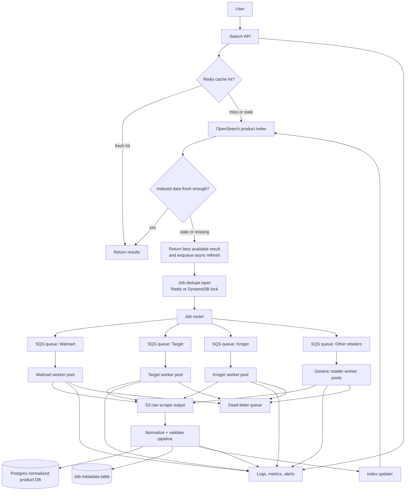

# Architecture Design: Reliable, Cost-Aware Search Infrastructure for Grocery Data

## 1. Problem Statement

This design supports a grocery savings product where users search for products near a ZIP code, compare prices across multiple retailers, and discover weekly deals.

For this assessment, I assume:

- 5,000 active users.
- 3 searches per active user per day.
- Around 15,000 searches per day.
- 6 retailers enabled today, with 10+ planned.
- Some data is preloaded, while some data must be refreshed on demand.
- Retailers vary in scraping latency, reliability, data freshness, and cost.

At this scale, raw API query throughput is not the hardest problem. The harder problem is controlling expensive and fragile background work: browser compute, proxy usage, retailer-specific failures, retries, duplicate jobs, and stale product data.

The system should therefore optimize the user-facing search path for latency, while optimizing the scraping path for freshness, reliability, and cost control.

## 2. Design Goals

The architecture should:

1. Return search results quickly.
2. Avoid redundant scraping.
3. Reuse cached and indexed data aggressively.
4. Isolate retailer-specific failures.
5. Control proxy, compute, and storage cost.
6. Support more retailers without rewriting the platform.
7. Provide useful logs, metrics, and debugging paths.

## 3. Non-Goals

Scraping should only be used when legally and operationally appropriate, and the system should prefer approved data access paths whenever possible.

## 3.1 Key Tradeoffs

This design intentionally favors a simple, modular architecture over a large enterprise data platform. At the current scale of about 15,000 searches per day, the main risk is not API throughput. The main risk is repeatedly triggering expensive and fragile retailer refresh work.

Because of that, I would start with Postgres, Redis, SQS, S3, OpenSearch, and a small worker fleet before adding more complex streaming or orchestration tools. Kafka, Kubernetes, and large-scale workflow systems could be considered later, but they would add operational overhead too early for this stage.

The core tradeoff is freshness versus cost. The system should not promise perfectly fresh prices on every search. Instead, it should return fast results with clear freshness labels, then refresh asynchronously when needed.

## 4. High-Level Architecture



## 5. Request Flow

### Normal Search Flow

1. The user searches for a product, for example `milk` near ZIP `90210`.
2. The Search API normalizes the query and derives the search context:
   - normalized query,
   - ZIP code,
   - nearby stores,
   - retailer scope,
   - freshness requirement.
3. The API checks Redis for a hot cached response.
4. If Redis has a fresh result, the API returns immediately.
5. If Redis misses, the API queries OpenSearch.
6. If OpenSearch has fresh enough indexed data, the API returns results and may populate Redis.
7. If results are stale or missing, the API returns the best available result and asynchronously enqueues refresh jobs.
8. The background workers refresh retailer data, normalize it, store it, and update the search index.

The API should never directly scrape retailers inside the user request path.

### Stale-While-Revalidate Behavior

When data exists but is stale, the system should prefer:

```text
return stale-but-labeled result now + refresh asynchronously
```

instead of:

```text
block the user until scraping finishes
```

This keeps search latency low and makes retailer failures less visible to users.

### API Response Behavior

The Search API should return a response that includes both results and freshness metadata.

Example response fields:

- `query`
- `zip_code`
- `results`
- `freshness_status: fresh | stale | partial | unavailable`
- `last_updated_at`
- `refresh_enqueued: true | false`
- `missing_retailers`

## 6. Preloaded vs On-Demand Data

### Preloaded Data

Preload data that is high-value, reusable, or relatively stable:

- top searched grocery products,
- popular category pages,
- weekly deals and promotions,
- stable product metadata,
- store metadata,
- retailer/store availability,
- common ZIP/store combinations.

Recommended schedule:

```text
Store metadata: daily
Stable product metadata: weekly
Popular catalog/category data: nightly
Weekly deals: nightly or aligned with retailer ad cycle
Top queries by ZIP/store: nightly
```

### On-Demand Data

Trigger on-demand jobs only when the expected value justifies the cost:

- long-tail queries,
- new ZIP/store combinations,
- stale price or promotion fields,
- cache misses for low-frequency products,
- retailer-specific missing results,
- user searches that repeatedly miss existing indexes.

This split prevents the system from scraping on every search request.

## 7. Component Responsibilities

### 7.1 Search API

Responsibilities:

- validate and normalize search requests,
- check Redis cache first,
- query OpenSearch when cache misses,
- decide whether data is fresh enough,
- return partial or stale-labeled results when appropriate,
- create refresh jobs only when needed,
- enforce request-level rate limits,
- emit logs and metrics.

The Search API should be stateless so it can scale horizontally.

### 7.2 Redis / ElastiCache

Redis is the speed and coordination layer, not the source of truth.

Use Redis for:

- hot search response cache,
- query-level TTL cache,
- pending-job locks,
- dedupe registry,
- freshness markers,
- negative cache after failures,
- short-lived rate-limit counters.

Example keys:

```text
search:{zip}:{normalized_query}:{retailer_scope}
joblock:{retailer_id}:{store_id}:{normalized_query}:{freshness_bucket}
negative:{retailer_id}:{store_id}:{normalized_query}
ratelimit:{retailer_id}
```

### 7.3 OpenSearch

OpenSearch is the low-latency search index.

Use OpenSearch for:

- product text search,
- retailer filtering,
- ZIP/store filtering,
- price and promotion ranking,
- deal score ranking,
- autocomplete or typeahead if needed.

OpenSearch should not be the raw source of truth. It should be rebuilt or repaired from normalized product records if needed.

### 7.4 Postgres

Use Postgres as the primary normalized data store for the prototype and initial production design.

Postgres stores:

- normalized products,
- retailer products,
- stores,
- prices,
- promotions,
- freshness timestamps,
- job metadata,
- failure records,
- audit/debug metadata.

A relational database is useful here because grocery search often needs structured joins across products, stores, retailers, prices, and promotions.

DynamoDB can be added later for very high-scale key-value job locks or metadata access, but Postgres keeps the first version simpler.

###  7.4.1 Minimal Data Model

A minimal relational model could include:

```text
retailers(id, name, enabled, base_url)
stores(id, retailer_id, zip_code, address, latitude, longitude)
products(id, canonical_name, brand, size, category)
retailer_products(id, retailer_id, product_id, retailer_sku, product_url)
prices(id, retailer_product_id, store_id, price, promo_price, currency, observed_at)
scrape_jobs(id, retailer_id, store_id, query, job_key, status, retry_count, created_at, updated_at)
```

### 7.5 S3 Raw Storage

Store raw scrape outputs in S3 before normalization.

Benefits:

- replay failed normalization jobs,
- debug parser breakage,
- inspect retailer markup changes,
- backfill data after schema fixes,
- preserve audit history without polluting the normalized database.

Suggested S3 path format:

```text
s3://prox-raw-scrapes/{retailer_id}/{yyyy}/{mm}/{dd}/{job_id}.json
```

### 7.6 Queue Layer

Use queues to decouple user-facing search from scraping execution.

Recommended production approach:

- SQS Standard queues per retailer for scalable background work.
- Application-level dedupe using Redis or DynamoDB locks.
- Dead-letter queue per retailer for failed jobs.
- Maximum worker concurrency per retailer.

SQS FIFO can be used if queue-level ordering or short-window deduplication is important, but strict ordering is not required for most grocery refresh jobs. Because business-level freshness windows are longer than queue-level deduplication windows, the system should not depend only on FIFO dedupe.

### 7.7 Worker Pools

Workers execute retailer-specific jobs.

Responsibilities:

- fetch retailer data,
- parse and extract product information,
- write raw output to S3,
- normalize records,
- validate required fields,
- write normalized records to Postgres,
- update OpenSearch,
- emit success/failure metrics,
- retry transient failures.

Worker implementation choice:

```text
Lightweight API/feed jobs: Lambda workers
Browser-heavy or long-running jobs: ECS/Fargate workers
Local prototype: Python worker process with mock retailer adapters
```

## 8. Retailer Adapter Model

Each retailer should be implemented behind a common adapter interface:

```text
RetailerAdapter
- search(query, store_context)
- parse(raw_response)
- normalize(parsed_result)
- validate(normalized_result)
```

Each adapter has its own configuration:

```text
retailer_id
enabled / disabled
max_concurrency
timeout_seconds
retry_limit
rate_limit_per_minute
freshness_sla
circuit_breaker_threshold
estimated_cost_per_job
```

This makes it easier to add the 7th, 8th, or 10th retailer without changing the core search API or queue system.

## 9. Deduplication Strategy

The system needs both queue-level and business-level deduplication.

Use a deterministic job key:

```text
sha256(retailer_id + store_id + zip_code + normalized_query + job_type + freshness_bucket)
```

Example:

```text
joblock:walmart:store_123:90210:milk:price_refresh:2026-04-24T10
```

Before enqueuing a job:

1. Build the deterministic job key.
2. Check whether a lock or pending job already exists.
3. If it exists, do not enqueue duplicate work.
4. If it does not exist, create the lock and enqueue the job.
5. Set the lock TTL based on freshness requirements.

Benefits:

- prevents duplicate scrape jobs,
- lets many users share one pending refresh,
- reduces proxy and browser compute cost,
- protects retailers from unnecessary load,
- makes worker behavior idempotent.

Workers should still be idempotent because duplicate messages can happen in distributed queue systems.

## 10. Freshness and TTL Strategy

Different data types need different TTLs.

Suggested policy:

```text
Store metadata: 24 hours
Stable product metadata: 7 days
Base catalog snapshots: 24 hours
Price fields: 6 to 12 hours
Promotion fields: 6 to 12 hours
Search response cache: 15 to 60 minutes
Negative cache after retailer failure: 10 to 15 minutes
Pending job lock: 10 to 60 minutes depending on job type
```

Freshness should be tracked at the field or retailer-result level when possible. A product title may still be valid for days, while the price may need refresh within hours.

## 11. Rate Limiting and Retailer Protection

Each retailer should have independent limits:

```text
max_concurrency
requests_per_minute
timeout_seconds
retry_budget
daily_job_cap
proxy_spend_cap
```

Example:

```text
walmart: max_concurrency=4, timeout=20s, retries=3
target:  max_concurrency=3, timeout=25s, retries=3
kroger:  max_concurrency=2, timeout=30s, retries=2
```

This protects both the platform and retailers. One slow retailer should not consume all worker capacity or delay jobs for other retailers.

## 12. Failure Isolation Strategy

Failure isolation happens at multiple layers:

### Retailer Queue Isolation

Each retailer has separate queues and worker concurrency limits. A Kroger parser failure should not block Walmart or Target refresh jobs.

### Circuit Breaker

Open a circuit breaker when a retailer becomes unhealthy.

Example trigger:

```text
retailer_failure_rate > 50% over 10 minutes
or
p95_fetch_latency > 3x baseline for 10 minutes
or
DLQ count > threshold
```

When open:

- pause new on-demand jobs for that retailer,
- continue scheduled jobs only if safe,
- serve stale cached results when available,
- label result freshness clearly,
- alert operators.

### Dead-Letter Queue

After retry exhaustion, send jobs to a retailer-specific DLQ for debugging and reprocessing.

### Degraded User Experience

If one retailer fails, the product should still return results from other retailers and clearly mark unavailable or stale retailer results.

## 13. Retry Strategy

Use bounded retries with exponential backoff:

```text
Attempt 1: immediate
Retry 1: after 30 seconds
Retry 2: after 2 minutes
Retry 3: after 10 minutes
Then: dead-letter queue
```

Rules:

- retry transient failures such as timeouts or temporary 5xx responses,
- do not retry validation errors indefinitely,
- do not retry when the circuit breaker is open,
- record retry count and final error reason.

## 14. Security and Secret Management

Never commit secrets to the repository.

Secrets include:

- retailer credentials,
- proxy API keys,
- session tokens,
- database passwords,
- API keys,
- internal service credentials.

Production:

- AWS Secrets Manager for secret storage and rotation.
- IAM roles for service-to-service access.
- Least-privilege permissions per worker and service.
- Separate secrets per environment.

Local development:

- `.env.example` documents required environment variables.
- `.env` is excluded from version control.
- Mock credentials are used in the prototype.

## 15. Logging, Monitoring, and Alerts

### Logs

Use structured logs for:

- request ID,
- job ID,
- retailer ID,
- normalized query,
- ZIP/store context,
- cache hit/miss,
- dedupe hit/miss,
- retry count,
- duration,
- final status,
- error category.

### Metrics

Track:

```text
search_latency_p50
search_latency_p95
cache_hit_rate
opensearch_latency_p95
queue_depth_by_retailer
worker_success_rate_by_retailer
worker_failure_rate_by_retailer
retry_count_by_retailer
dlq_count_by_retailer
dedupe_suppression_count
freshness_age_by_data_type
scrape_jobs_per_day
estimated_proxy_cost_by_retailer
estimated_compute_cost_by_retailer
```

### Alerts

Initial alerts should focus on user impact and runaway cost:

```text
search_latency_p95 too high
cache_hit_rate suddenly drops
retailer failure rate exceeds threshold
DLQ count exceeds threshold
queue depth grows continuously
daily scrape cap nearly reached
proxy spend cap nearly reached
OpenSearch errors increase
```

## 16. Cost Controls

The highest-cost areas are likely:

- browser-based scraping,
- proxy usage,
- retries during retailer instability,
- duplicate jobs,
- storing unnecessary raw outputs forever.

Cost guardrails:

1. Cache-first search path.
2. Preload reusable high-demand data.
3. Business-level dedupe locks.
4. Per-retailer concurrency limits.
5. Retry caps.
6. Circuit breakers.
7. Daily scrape caps.
8. Proxy spend caps.
9. S3 lifecycle policies for raw outputs.
10. Prefer API/feed integrations over browser automation.

AWS Budgets can alert the team when spend approaches or exceeds thresholds, but application-level limits should stop runaway scraping before cloud billing becomes the first signal.

## 17. Scaling Strategy

At 15,000 searches per day, the user-facing API can be handled by a modest horizontally scalable service. Scaling pressure is more likely to come from background scraping and freshness requirements.

Scale by:

- increasing API replicas independently,
- increasing OpenSearch capacity independently,
- tuning Redis TTLs,
- sharding queues by retailer,
- increasing worker pools only for healthy retailers,
- adding new retailer adapters behind the same interface,
- expanding preloaded coverage for popular ZIP/product combinations,
- reducing on-demand scraping through better cache reuse.

This architecture can scale from 6 retailers to 10+ retailers because each new retailer is added as a separate adapter, queue, worker configuration, rate-limit policy, and circuit breaker configuration.

## 18. Prototype Scope

The prototype should prove the architecture without depending on brittle live scraping.

Recommended prototype features:

- FastAPI endpoint accepting search requests.
- In-memory or Redis-backed TTL cache.
- Deterministic job key generation.
- Queue abstraction.
- Mock retailer adapters with different latency and failure rates.
- Per-retailer concurrency limits.
- Retry with exponential backoff.
- Failed job list acting as a mock DLQ.
- Structured logs showing:
  - cache hit/miss,
  - dedupe hit/miss,
  - job enqueued,
  - job skipped as duplicate,
  - retry attempts,
  - final success/failure.

Example prototype flow:

```text
POST /search {"query": "milk", "zip_code": "90210"}

1. API checks cache.
2. Cache misses.
3. API returns stale or empty initial result.
4. API creates job keys for enabled retailers.
5. Duplicate jobs are suppressed.
6. Worker processes jobs with concurrency limits.
7. Failed jobs retry with backoff.
8. Successful jobs update normalized store and cache.
```

This prototype demonstrates the core system design: cache-first search, asynchronous refresh, dedupe, rate limiting, failure isolation, and cost control.
