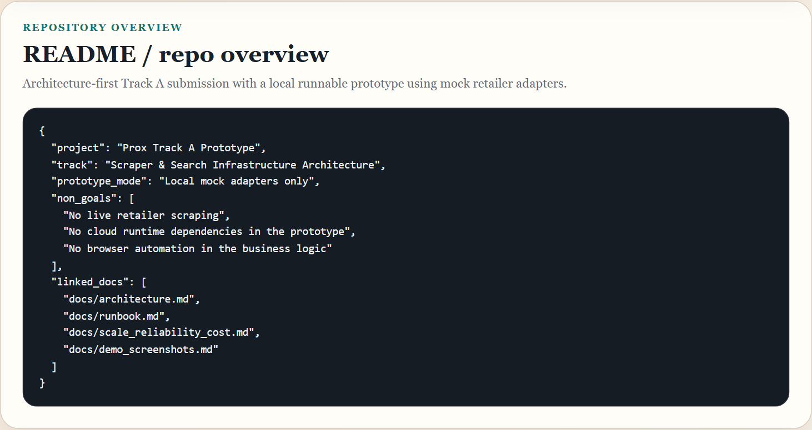
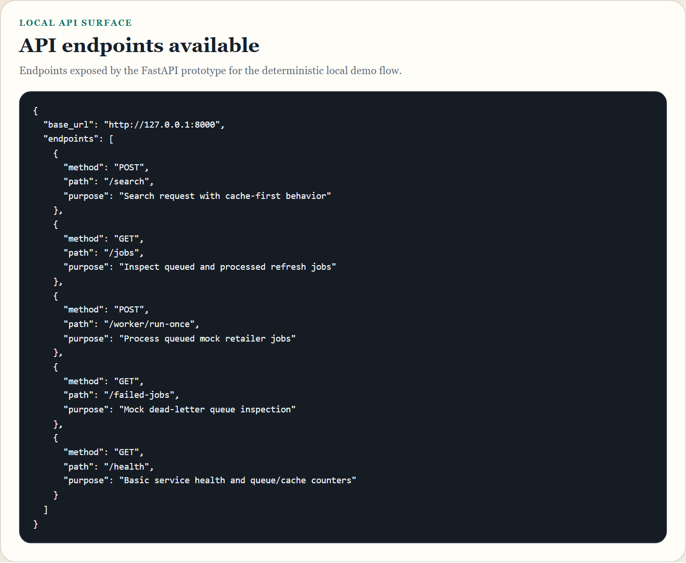
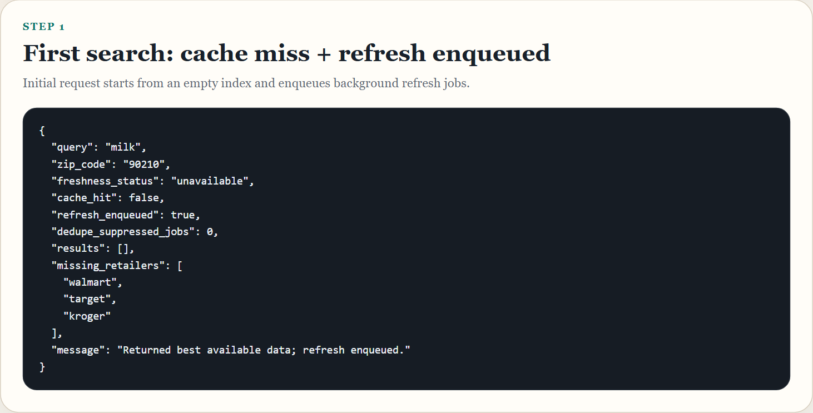
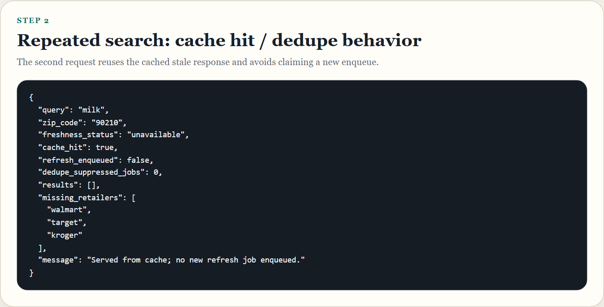
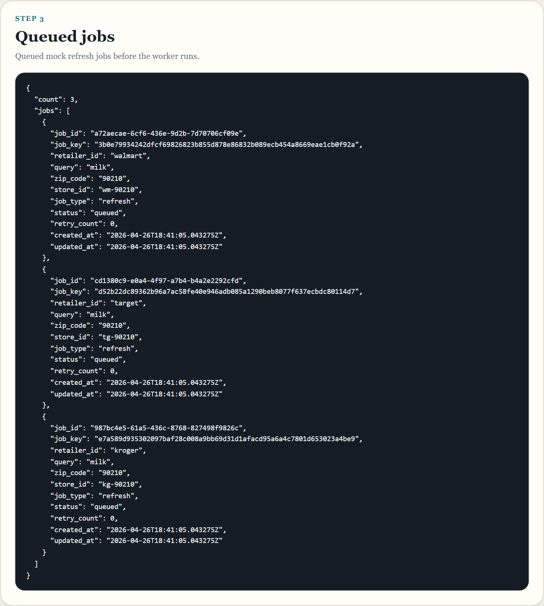
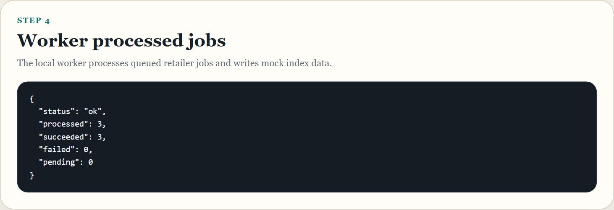
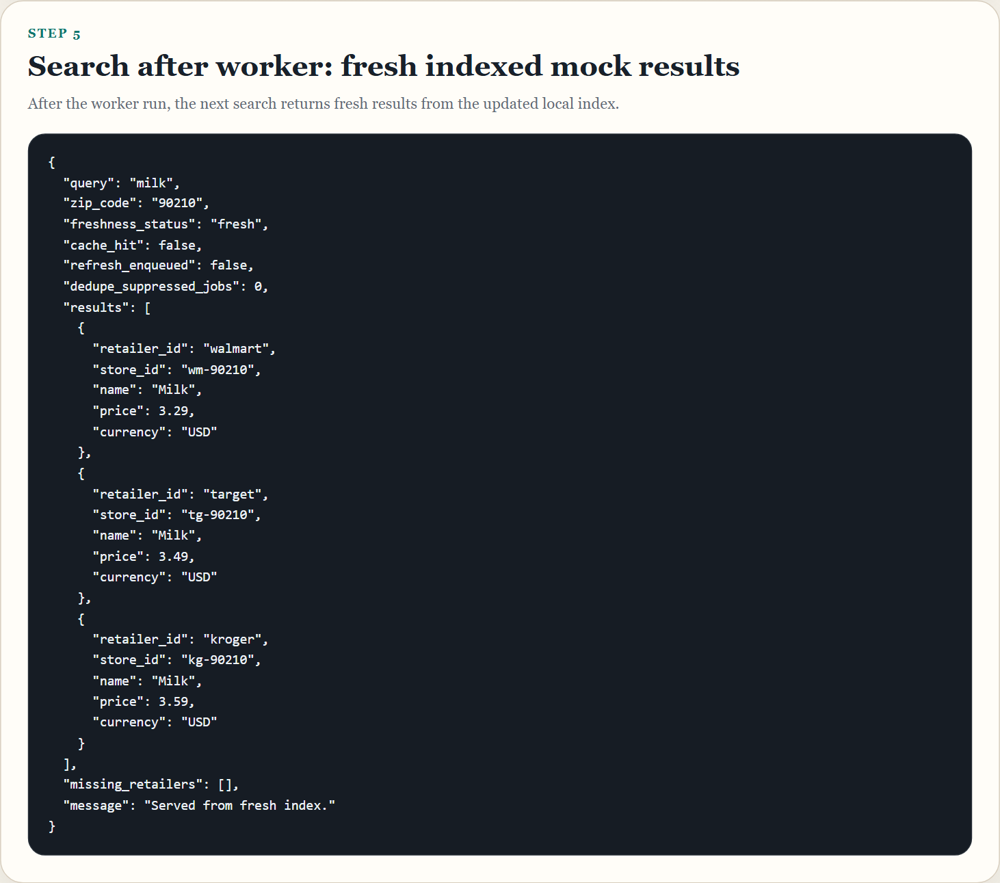
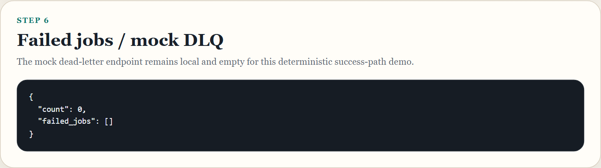
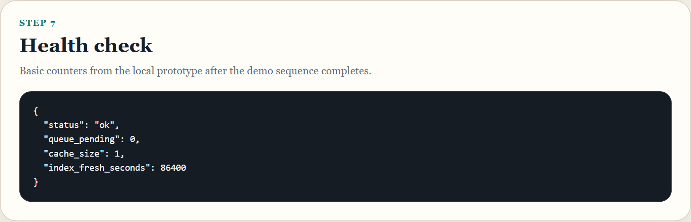

# Demo Screenshots

## Overview

This evidence package was generated from the **local Track A prototype** using **mock retailer adapters**, not live retailer scraping.

The screenshot flow demonstrates:

- repository overview,
- available API endpoints,
- first search with cache miss and refresh enqueue,
- repeated search with cache-hit behavior,
- queued jobs,
- worker execution,
- fresh indexed mock results after worker run,
- failed jobs / mock DLQ endpoint,
- and health output.

## Exact Commands

Install runtime dependencies:

```bash
pip install -r requirements.txt
```

Install optional screenshot helper dependency:

```bash
pip install -r dev-requirements-screenshots.txt
python -m playwright install chromium
```

Generate screenshots:

```bash
python -m compileall prototype
uvicorn prototype.app:app --reload
python -m prototype.demo
python scripts/generate_demo_screenshots.py
```

Notes:

- `scripts/generate_demo_screenshots.py` resets `prototype/data/mock_index.json` to `{}` and `prototype/data/failed_jobs.json` to `[]` before running the capture flow.
- The script starts its own local API process for deterministic evidence generation, then restores both JSON files to the empty baseline afterward.
- The prototype remains local and lightweight. No live scraping, AWS runtime services, Redis, SQS, OpenSearch, Selenium, or Docker are added to the business-logic prototype.

## Screenshots

### 1. README / repo overview



Caption: Submission overview and scope for the Track A prototype.

### 2. API endpoints available



Caption: Local FastAPI endpoints used in the demo sequence.

### 3. First search: cache miss + refresh enqueued



Caption: First `milk / 90210` search starting from an empty local index.

### 4. Repeated search: cache hit / dedupe behavior



Caption: Repeated request reuses the cached response and does not claim a new enqueue.

### 5. Queued jobs



Caption: Mock refresh jobs waiting in the local queue before worker execution.

### 6. Worker run



Caption: Worker run result for local mock retailer refresh processing.

### 7. Search after worker: fresh indexed mock results



Caption: Search result after worker processing, showing fresh indexed mock retailer data.

### 8. Failed jobs / mock DLQ endpoint



Caption: Mock dead-letter endpoint for the deterministic success-path run.

### 9. Health endpoint



Caption: Health output from the local prototype after the demo sequence.
